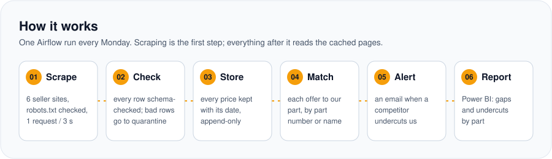
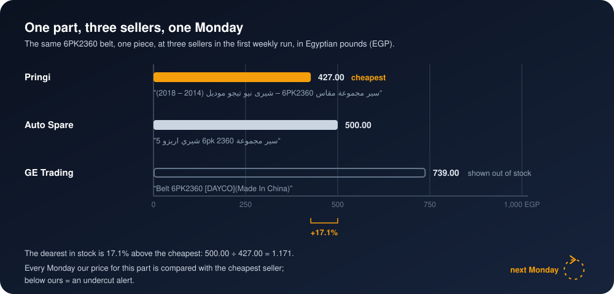

<p align="center">
  
</p>

<p align="center">
  
  
  
  
  
</p>

<h3 align="center">Know every Monday where each of your parts is cheaper at a competitor,<br>and by how much.</h3>

## The problem

A spare-parts retailer sells the same belts, filters and spark plugs as a dozen online shops, and
their prices move every week. Nobody can say, part by part, which competitor is cheaper and by how
much, so the customer finds out first and the sale goes elsewhere. And no one wrote last month's
prices down, so a one-week promotion cannot be told apart from a new normal.

## 🛠️ The solution

A pipeline that runs once a week on its own, reads every competitor's prices and keeps every price
it ever sees.

<p align="center">
  
</p>

1. **Collect.** Every week the run reads each competitor's product pages, seller by seller, and
   keeps a copy of every page it reads.
2. **Check.** Every price row is checked before it is stored. A bad row is set aside with the
   reason, never silently dropped.
3. **Store.** Every price goes into the history with the day it was seen. Nothing is updated or
   deleted, so any price change can be found again later.
4. **Match.** Each competitor part is matched to yours: by part number where both list one,
   otherwise by part type and car model.
5. **Report.** An email when a competitor sells one of your parts below your price, and Power BI
   pages for the gaps by part and seller and the price changes week by week.

### 🔁 The mental model: one part, three sellers, one Monday

<p align="center">
  
</p>

The same part is sold by several sellers. It is found at each of them by its part number where they
share one, otherwise by part type and car model. Every price is kept with the date it was seen, so
the history only grows. Each Monday the cheapest price for each part is compared with yours; a
competitor below you is an undercut.

## 📈 The result

**<!--n:offers-->12,613<!--/n--> prices from <!--n:sellers-->5<!--/n--> Egyptian sellers in the
first weekly run.**

- **Prices by seller:** Auto Spare <!--n:offers_autospare-->9,981<!--/n-->, Pringi
  <!--n:offers_pringi-->1,308<!--/n-->, N Auto Express <!--n:offers_nautoexpress-->1,135<!--/n-->,
  Spare Zone <!--n:offers_sparezone-->124<!--/n-->, Garage ILLA <!--n:offers_garageilla-->65<!--/n-->.
- **<!--n:pages-->727<!--/n--> pages read** and kept; every page re-parsed from the kept copy gives
  identical results.
- **<!--n:quarantined-->0<!--/n--> rows set aside** by the check.
- **<!--n:shared_codes-->24<!--/n--> part codes sold by two sellers or more:**
  <!--n:shared_belt_codes-->23<!--/n--> belt sizes and <!--n:shared_plug_codes-->1<!--/n-->
  spark-plug code.
- **The same belt, 6PK2360,** costs <!--n:spread_6pk2360_pct-->115<!--/n-->% more at the dearest
  seller than at the cheapest (the picture above).

<!-- charts from analysis/analysis.ipynb land here -->

## 🧰 The product

What you get each week: a Power BI comparison of your parts against every seller, an undercut email, and the price history per part and seller.<br>
What I need from you: your catalogue as one CSV (part number, brand, family, your price), the competitor sites you care about, and an email address for the alerts.<br>
How it runs: one Docker stack, run weekly by Airflow on your machine, or hosted by me.

## 📊 Power BI

The report reads the warehouse directly. The [powerbi/](powerbi/) folder rebuilds it from an
empty file by copy and paste: the queries, the model, every measure, every visual with its
fields, the theme, and the numbers each card must show.
<!-- Screenshots of the pages go here once the report is built: powerbi/screenshots/ -->

## ▶️ Run it

You need Docker Desktop.

```bash
git clone https://github.com/omarshalabyy1/egypt-spare-parts-prices
cd egypt-spare-parts-prices
cp .env.example .env          # set WAREHOUSE_PASSWORD; the Gmail lines are optional
docker compose up -d --build  # Airflow http://127.0.0.1:8100, warehouse localhost:5450
```

Open Airflow at http://127.0.0.1:8100 and unpause `spare_parts_prices`. It runs once a week from
then on.

Then the numbers and the tests:

```bash
pip install -r analysis/requirements.txt
jupyter lab analysis/analysis.ipynb
python -m pytest
```

For a seller that only opens in a visible browser, run `python scripts/fetch_with_browser.py <seller_id>`:
you clear any challenge, login or cookie banner yourself in the window, and the session is kept in
`.browser-profile/`, which is never committed.

| Where | What |
|---|---|
| [tracker.py](tracker.py) | The weekly steps, one function each |
| [scrape.py](scrape.py) | Reading the pages, keeping a copy of each, and the row check |
| [scrapers/](scrapers/) | One module per seller |
| [dags/spare_parts_prices.py](dags/spare_parts_prices.py) | The weekly Airflow DAG |
| [sql/schema.sql](sql/schema.sql) | Tables, the price history, and the gap, undercut and change views |
| [docs/layers.svg](docs/layers.svg) | The warehouse layers: raw pages, parsed offers, the star for Power BI |
| [data/](data/) | The sellers, the catalogue, and the kept pages by seller and week |
| [analysis/](analysis/) | The notebook behind every number |
| [powerbi/](powerbi/) | The report, step by step |
| [tests/](tests/) | Saved pages for each seller, the page reader and the row check |

## 🗂️ Data

- **Competitor prices are real,** read from the public product pages and APIs of Egyptian
  spare-parts sellers: Auto Spare, Pringi, N Auto Express, Spare Zone, Garage ILLA, Jumia,
  egycarparts, Tawfiqia, Fit and Fix, Your Parts, GE Trading, Zait and Filters and Amazon Egypt.
- **The pace** is one request every 3 seconds per site.
- **The retailer and its catalogue** ([data/catalogue.csv](data/catalogue.csv)) are made up.
