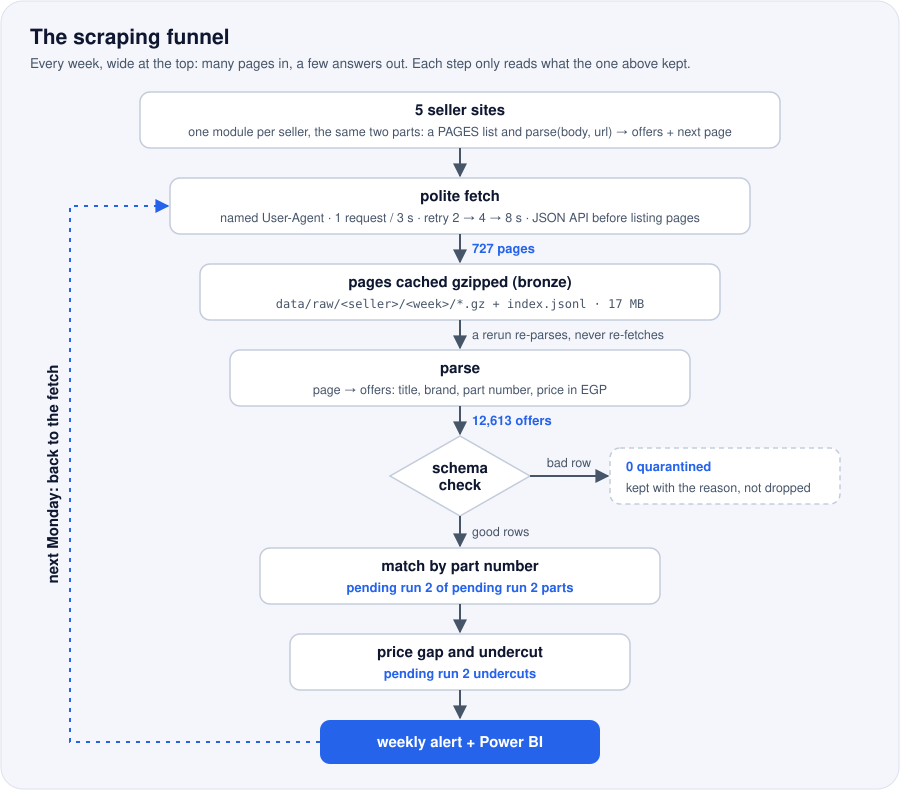
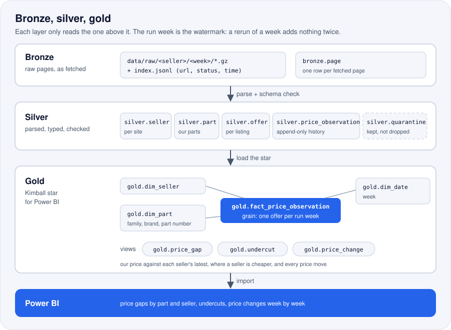

<p align="center">
  
</p>

<p align="center">
  
  
  
  
  
</p>

<h3 align="center"><!--n:offers-->12,613<!--/n--> spare-part offers from <!--n:sellers-->5<!--/n--> Egyptian sellers, checked every week:<br><!--n:cheaper_pct-->pending run 2<!--/n-->% of our parts are cheaper somewhere, by a median <!--n:median_gap_pct-->pending run 2<!--/n-->%</h3>

## The problem

A spare-parts retailer sells the same oil filters, spark plugs and brake pads as a dozen online
shops, and prices move every week. Nobody can say, part by part, where the same part number is
cheaper at a competitor and by how much, so customers find out first and the sale goes elsewhere.

## 🛠️ The solution

A pipeline that runs once a week on its own, reads every competitor's prices, and keeps every
price it ever sees.

<p align="center">
  
</p>

1. **Scrape.** One request every 3 seconds per site, with a named User-Agent and retries after
   2, 4 and 8 seconds. Every page is kept gzipped, so nothing has to be fetched twice.
2. **Check.** Each parsed offer must have a title, a link, a listing key and a price in EGP.
   A row that fails goes to quarantine with the reason, never silently dropped.
3. **Store.** Every price goes into the history with the day it was seen. Nothing is updated or
   deleted, so any price change can be found again later.
4. **Match.** Each offer is paired with our part by its part number, so the same part is
   compared across every seller that has it.
5. **Alert.** The run emails the parts a competitor now sells below our price.
6. **Report.** Power BI pages for the price gap by part and seller, the undercuts, and the
   price changes week by week.

### 🔁 The mental model: a funnel, every week

<p align="center">
  
</p>

Each seller is one small module with the same two parts: a `PAGES` list of where its parts are
listed, and `parse(body, url)`, which turns one page into offers plus the next page to read
([scrapers/](scrapers/)). Where a shop has a JSON API (the Shopify and WooCommerce shops do), it
is read instead of the HTML listing pages: fewer requests, and prices that are already numbers.
One shared fetcher ([scrape.py](scrape.py)) keeps the pace, retries with backoff, and caches
every page, so a rerun re-parses the kept pages instead of fetching them again. The schema check
sits between parsing and the history: a broken parser shows up as quarantined rows, not as
wrong prices.

<p align="center">
  
</p>

Bronze is the pages exactly as fetched, one gzipped file per page with an `index.jsonl` line
saying when and with what status. Silver is the parsed, typed and checked offers with the
append-only price history; gold is a star for Power BI, one price observation per offer per run
week. The run week is the watermark: rerunning a week re-reads that week's kept pages and adds
nothing it already holds. These are the target schemas the warehouse is moving to; today the
tables and the gap, undercut and price-change views live in one schema in
[sql/schema.sql](sql/schema.sql).

## 🧰 The product

This tracker is also a service I set up for Egyptian spare-parts retailers.

### What you get every week

- The price comparison in Power BI: each of your parts against every seller that has it, with
  the gap in EGP and in percent.
- The undercut email: the parts a competitor now sells below your price.
- The price history per part and seller, kept from the first week, so a one-week promotion is
  told apart from a new normal.

### What I need from you

- Your catalogue as one CSV: part number, brand, family and your price.
- The list of competitor sites you care about.
- An email address for the alerts.

### How it runs

One Docker stack, run weekly by Airflow, on your machine or hosted by me.

## 📈 The result

**<!--n:offers-->12,613<!--/n--> offers from <!--n:sellers-->5<!--/n--> sellers in the first
weekly run.** The checks behind every number are in [the notebook](analysis/analysis.ipynb).

- **<!--n:sellers-->5<!--/n--> sellers** read, **<!--n:pages-->727<!--/n--> pages** fetched and
  kept (<!--n:raw_mb-->17<!--/n--> MB gzipped), **<!--n:offers-->12,613<!--/n--> offers** parsed.
- **<!--n:quarantined-->0<!--/n--> rows quarantined** by the schema check.
- **Parts matched:** <!--n:matched_parts-->pending run 2<!--/n--> of our
  <!--n:parts-->pending run 2<!--/n--> parts found at one seller or more;
  <!--n:multi_seller_parts-->pending run 2<!--/n--> at two sellers or more.
- **Cheaper somewhere:** <!--n:cheaper_pct-->pending run 2<!--/n-->% of our matched parts,
  by a median <!--n:median_gap_pct-->pending run 2<!--/n-->%.
- **Widest spread** between sellers for the same part: <!--n:max_spread_pct-->pending run 2<!--/n-->%.
- **<!--n:undercuts-->pending run 2<!--/n--> undercuts** this week.

<!-- Charts from analysis/analysis.ipynb go here once the PNGs exist:
<p align="center">
  
  
</p>
-->

## 📊 Power BI

The report reads the warehouse directly. The [powerbi/](powerbi/) folder rebuilds it from an
empty file by copy and paste: the queries, the model, every measure, every visual with its
fields, the theme, and the numbers each card must show.
<!-- Screenshots of the pages go here once the report is built: powerbi/screenshots/ -->

## ▶️ Run it

You need Docker Desktop.

```bash
git clone https://github.com/omarshalabyy1/egypt-spare-parts-prices
cd egypt-spare-parts-prices
cp .env.example .env          # set WAREHOUSE_PASSWORD; the Gmail lines are optional
docker compose up -d --build  # Airflow http://127.0.0.1:8100, warehouse localhost:5450
```

Open Airflow at http://127.0.0.1:8100 and unpause `spare_parts_prices`. The first run is the week
of 5 October 2026, whose pages are committed in [data/raw/](data/raw/): the fetcher finds each
page already kept and reads it from disk, so that run makes no request to any seller and only
re-parses. A live run, fetching every page at one request every 3 seconds, took
<!--n:run_minutes-->64<!--/n--> minutes. Every later week has no kept pages and is fetched live
when its run comes due, once a week. The match and alert steps are the next to land; until then
those two tasks pass without doing anything.

Then the numbers and the tests:

```bash
pip install -r analysis/requirements.txt
jupyter lab analysis/analysis.ipynb
pip install -r requirements.txt pytest && python -m pytest
```

| Where | What |
|---|---|
| [tracker.py](tracker.py) | The weekly steps: load reference data, fetch, parse, match, alert; one function each |
| [scrape.py](scrape.py) | The shared fetcher, the page cache and the schema check |
| [scrapers/](scrapers/) | One module per seller: its `PAGES` and its `parse` |
| [dags/spare_parts_prices.py](dags/spare_parts_prices.py) | The weekly Airflow DAG, one fetch task per seller side by side |
| [sql/schema.sql](sql/schema.sql) | Tables, the append-only price history, and the gap, undercut and change views |
| [data/](data/) | The sellers, our catalogue, and the kept raw pages by seller and week |
| [analysis/](analysis/) | The notebook behind every number |
| [powerbi/](powerbi/) | The report, step by step |
| [tests/](tests/) | Saved pages for each parser, the fetcher and the schema check |

## 🗂️ Data

Competitor prices are read from the sellers' own product pages and APIs, the way any shopper's
browser sees them; the retailer and its catalogue ([data/catalogue.csv](data/catalogue.csv)) are
generated.

| Seller | Website | How it is read | Rate | Offers |
|---|---|---|---|---|
| AutoSpare | [autospare.com.eg](https://autospare.com.eg) | listing pages | 1 request / 3 s | <!--n:offers_autospare-->9,981<!--/n--> |
| Pringi | [pringi.com](https://pringi.com) | JSON API (WooCommerce Store API) | 1 request / 3 s | <!--n:offers_pringi-->1,308<!--/n--> |
| N Auto Express | [nautoexpress.com](https://nautoexpress.com) | JSON API (Shopify) | 1 request / 3 s | <!--n:offers_nautoexpress-->1,135<!--/n--> |
| Spare Zone | [sparezone-eg.com](https://sparezone-eg.com) | listing pages | 1 request / 3 s | <!--n:offers_sparezone-->124<!--/n--> |
| Garageilla | [garageilla.com](https://garageilla.com) | JSON API (Shopify) | 1 request / 3 s | <!--n:offers_garageilla-->65<!--/n--> |

Joining in the second run, at the same pace:

| Seller | Website | Offers |
|---|---|---|
| Jumia | [jumia.com.eg](https://www.jumia.com.eg) | <!--n:offers_jumia-->pending run 2<!--/n--> |
| Egy Car Parts | [egycarparts.com](https://egycarparts.com) | <!--n:offers_egycarparts-->pending run 2<!--/n--> |
| Tawfiqia | [tawfiqia.com](https://tawfiqia.com) | <!--n:offers_tawfiqia-->pending run 2<!--/n--> |
| Fit and Fix | [fitandfix.com](https://www.fitandfix.com) | <!--n:offers_fitandfix-->pending run 2<!--/n--> |
| Your Parts | [yourparts.com](https://www.yourparts.com) | <!--n:offers_yourparts-->pending run 2<!--/n--> |
| GE Trading | [getradingeg.com](https://www.getradingeg.com) | <!--n:offers_getradingeg-->pending run 2<!--/n--> |
| Zait and Filters | [zaitandfilters.com](https://zaitandfilters.com) | <!--n:offers_zaitandfilters-->pending run 2<!--/n--> |
