  

  
  
  
  
  

<h2 align="center">Nissan Sunny spare parts, every Egyptian seller</h2>

<h3 align="center">Every Sunny part the Egyptian online sellers list, in one file, cheapest first.</h3>

## The result

**<!--n:parts_below_part_number-->5<!--/n--> of the <!--n:parts_part_number-->7<!--/n--> Nissan Sunny parts sold under the same part number by
two sellers or more have one at least 5% below the market's middle price**
(<!--n:parts_below_part_number_pct-->71.4<!--/n-->%). For the same part number, the dearest seller is a median
<!--n:spread_median_pct_part_number-->25.9<!--/n-->% above the cheapest (<!--n:spread_groups_part_number-->5<!--/n--> parts
with 3 prices or more at 2 sellers or more). The market's middle price is the median of the sellers' comparable prices.
Every number on this page comes from [the notebook](analysis/analysis.ipynb), run with `car_key: nissan-sunny` in
[config/client.yaml](config/client.yaml).

<!--n:offers-->557<!--/n--> listings from <!--n:sellers-->11<!--/n--> sellers name the Nissan Sunny in run week
<!--n:run_week-->2026-10-05<!--/n-->; 27 of them state a fit up to 2023 or later, all as 2014 to 2025, and none names
the N18 generation.[^1]

## Price list

[analysis/price_list.csv](analysis/price_list.csv) holds every listing for the car, by part type and cheapest first
within each part type (listings with no part type read from the title come last), with the seller, price, stock,
brand, title and link. The first 10 rows:

| Part type | Seller | Price (EGP) | Title |
|---|---|---:|---|
| air filter | GE Trading | 82.00 | Air Filter Nissan Sunny N17 [After Market] (ED500) |
| air filter | Tawfiqia | 95.00 | فلتر هواء  نيسان صني N16 موديل 2001-2014 |
| air filter | Tawfiqia | 95.00 | فلتر هواء كوري نيسان صني N17 |
| air filter | GE Trading | 120.00 | Air Filter Nissan Sunny N16 (High Tech) (Made in China) (7400 or 16546-V0100) |
| air filter | GE Trading | 135.00 | Air Filter Nissan Sunny N17 [High Tech] (Made in China) (16546-ED500) |
| air filter | AutoSpare | 140.00 | فلتر هواء نيسان صني N17 |
| air filter | AutoSpare | 150.00 | فلتر هواء نيسان صني N16 |
| air filter | AutoSpare | 150.00 | فلتر هواء نيسان صني N17 |
| air filter | AutoSpare | 150.00 | فلتر هواء نيسان صني N17 فيس ليفت |
| air filter | AutoSpare | 190.00 | فلتر هواء نيسان صني N16 |

Listings are grouped by part type only; same-type prices are not like-for-like (a hand audit found 13 of 30 such groups fully clean), so compare exact part numbers above.

## Run it

It runs as on main: see Run it in [main's README](https://github.com/omarshalabyy1/egypt-spare-parts-prices/blob/main/README.md).
This branch differs from main only in `car_key` in [config/client.yaml](config/client.yaml) and in the files the
notebook writes from it.

[^1]: Counted with `SELECT count(*) FILTER (WHERE year_to >= 2023 OR generation = 'N18') FROM silver.offer WHERE car_key LIKE 'nissan-sunny%'`
    after the run of week 2026-10-05.
