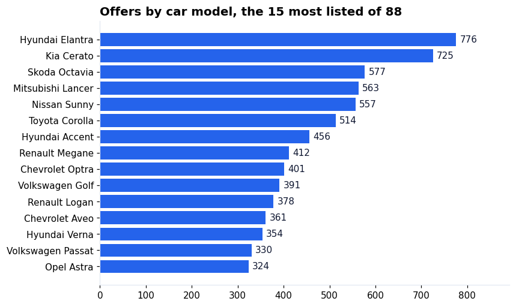
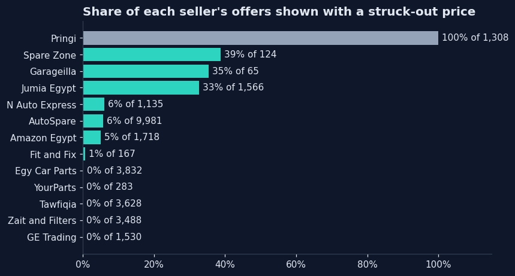
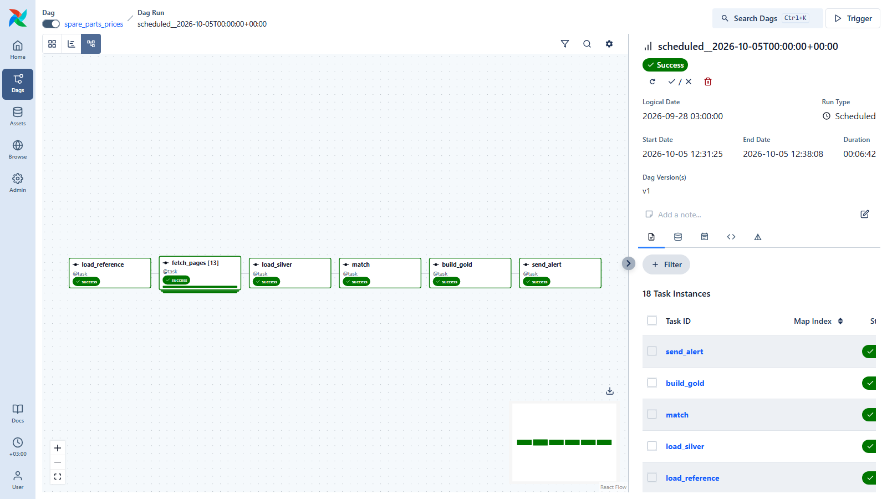
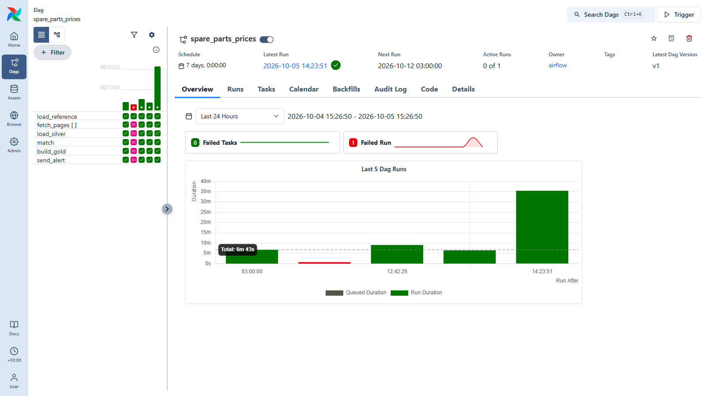
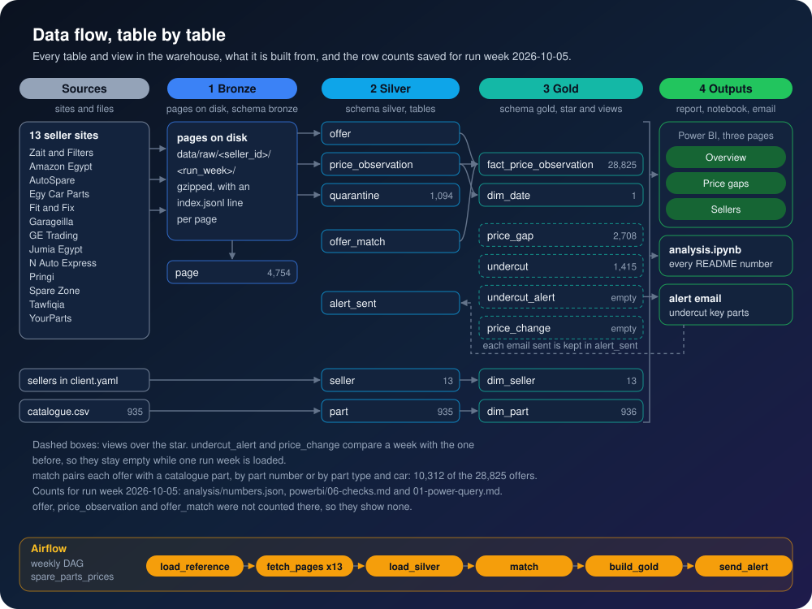
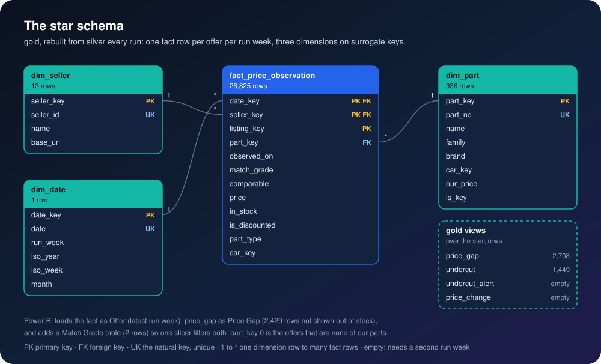

<p align="center">
  
</p>

<p align="center">
  
</p>

<p align="center">
  
  
  
  
  
</p>

<h3 align="center">Know every Monday where each of your parts is cheaper at a competitor,<br>and by how much.</h3>

## The problem

A spare-parts retailer sells the same belts, filters and spark plugs as a dozen online shops, and
their prices move every week. Nobody can say, part by part, which competitor is cheaper and by how
much, so the customer finds out first and the sale goes elsewhere. And no one wrote last month's
prices down, so a one-week promotion cannot be told apart from a new normal.

## 🛠️ The solution

A pipeline that runs once a week on its own, reads every competitor's prices and keeps every price
it ever sees.

<p align="center">
  
</p>

1. **Collect.** Every week the run reads each competitor's product pages, seller by seller, and
   keeps a copy of every page it reads.
2. **Check.** Every price row is checked before it is stored. A bad row is set aside with the
   reason, never silently dropped.
3. **Store.** Every price goes into the history with the day it was seen. Nothing is updated or
   deleted, so any price change can be found again later.
4. **Match.** Each competitor part is matched to yours: by part number where both list one,
   otherwise by part type and car model.
5. **Report.** An email when a competitor sells one of your parts below your price, and Power BI
   pages for the gaps by part and seller and the price changes week by week.

### 🔁 The mental model: one part, three sellers, one Monday

<p align="center">
  
</p>

The same part is sold by several sellers. It is found at each of them by its part number where they
share one, otherwise by part type and car model. Every price is kept with the date it was seen, so
the history only grows. Each Monday the cheapest price for each part is compared with yours; a
competitor below you is an undercut.

## 📈 The result

<p align="center">
  
</p>

**<!--n:parts_below_part_number-->88<!--/n--> of the <!--n:parts_part_number-->154<!--/n--> parts sold under the same part number by
two sellers or more have one at least 5% below the market's middle price**
(<!--n:parts_below_part_number_pct-->57.1<!--/n-->%). Our price is made up: the median of the sellers' comparable prices.
Every number below comes from [the notebook](analysis/analysis.ipynb).

- **At the cheapest seller,** a part sold under the same part number costs a median
  **<!--n:undercut_gap_median_pct_part_number-->26.3<!--/n-->% less** than our price.
- **Shopping around pays:** for the same part number, the dearest seller is a median
  **<!--n:spread_median_pct_part_number-->38.3<!--/n-->% above the cheapest**
  (<!--n:spread_groups_part_number-->61<!--/n--> parts with 3 prices or more at 2 sellers or more).
- **Which cars:** <!--n:offers_with_car_pct-->58.3<!--/n-->% of the prices name the car,
  <!--n:car_models-->90<!--/n--> models of <!--n:car_makes-->22<!--/n--> makes; the most listed is the
  <!--n:top_model-->Hyundai Elantra<!--/n--> (<!--n:top_model_offers-->776<!--/n--> prices).
- **In stock:** where the seller says, <!--n:in_stock_pct-->89.5<!--/n-->% of
  <!--n:stock_stated_offers-->20,116<!--/n--> prices are marked in stock.
- **Read in full:** for the four sites that state their own count (Auto Spare, Tawfiqia, Jumia and
  Fit and Fix), the run read between <!--n:coverage_jumia_pct-->99.8<!--/n-->% and
  <!--n:coverage_autospare_pct-->100.0<!--/n-->% of what each site says it lists.
- **Discounts:** <!--n:discount_share_pct-->9.1<!--/n-->% of the prices are shown with a struck-out
  price; <!--n:discount_always_sellers-->1<!--/n--> seller, Pringi, shows one on
  <!--n:discount_share_pringi_pct-->100.0<!--/n-->% of its prices.
- **Set aside:** <!--n:quarantine_pct-->3.7<!--/n-->% of the rows failed the check, most of them
  (<!--n:quarantined_getradingeg-->1,052<!--/n--> of <!--n:quarantined-->1,094<!--/n-->) GE Trading
  listings with no price or a placeholder price.

Comparisons of the same part type for the same car are not shown: they did not pass a hand audit of match precision (see the notebook).

**What one weekly run reads:** <!--n:offers-->28,825<!--/n--> prices from <!--n:sellers-->13<!--/n--> Egyptian
sellers on <!--n:pages-->4,754<!--/n--> pages, each page kept. <!--n:quarantined-->1,094<!--/n--> rows were set aside
by the check, <!--n:quarantined_getradingeg-->1,052<!--/n--> of them GE Trading listings with no price or a
placeholder price. <!--n:shared_codes-->154<!--/n--> parts are matched by part number, the same code at two sellers or
more: <!--n:shared_belt_codes-->113<!--/n--> belts, <!--n:shared_filter_codes-->32<!--/n--> filters,
<!--n:shared_brake_pad_codes-->7<!--/n--> brake pads and <!--n:shared_wiper_codes-->2<!--/n--> wipers. The same belt,
6PK2360, costs <!--n:spread_6pk2360_pct-->17.1<!--/n-->% more at the dearest seller with it in stock than at the
cheapest (the picture above). Price changes week over week start with the second run week.

<p align="center">
  
  
</p>

## 🧰 The product

What you get each week: a Power BI comparison of your parts against every seller, an undercut email, and the price history per part and seller.<br>
What I need from you: your catalogue as one CSV (part number, brand, family, your price), the competitor sites you care about, and an email address for the alerts.<br>
How it runs: one Docker stack, run weekly by Airflow on your machine, or hosted by me.

## 📊 Power BI

The report reads the warehouse directly. The [powerbi/](powerbi/) folder rebuilds it from an
empty file by copy and paste: the queries, the model, every measure, every visual with its
fields, the theme, and the numbers each card must show.
<!-- Screenshots of the pages go here once the report is built: powerbi/screenshots/ -->

## ▶️ Run it

<p align="center">
  
</p>

You need Docker Desktop. Two checkouts of this repo cannot run side by side: the Compose project
name, its volumes and the ports 5450 and 8100 are fixed.

```bash
git clone https://github.com/omarshalabyy1/egypt-spare-parts-prices
cd egypt-spare-parts-prices
cp .env.example .env          # set WAREHOUSE_PASSWORD; the Gmail lines are optional
docker compose up -d --build  # Airflow http://127.0.0.1:8100, warehouse localhost:5450
curl http://127.0.0.1:8100/api/v2/monitor/health  # wait until the scheduler shows healthy, about a minute
docker compose exec airflow airflow dags unpause spare_parts_prices  # or unpause it in Airflow's page
```

Once unpaused, the first run starts at once, for the week ending 2026-10-05, then once a week. The
committed week ending 2026-10-05 is replayed from the pages under `data/raw/` without a request, in a
few minutes; any later week is fetched live. A live week is bound by its slowest seller, as the
sellers are fetched side by side: Zait and Filters, about <!--n:fetch_longest_minutes-->180<!--/n--> minutes.

### How it runs

<p align="center">
  
  
</p>

The weekly run replaying the committed week ending <!--n:run_week-->2026-10-05<!--/n-->, every step green
(left); the grid keeps every run, including an earlier manual run that failed (right, in red).

Then the tests and the numbers:

```bash
pip install -r requirements.txt -r analysis/requirements.txt pytest
export $(grep ^WAREHOUSE_PASSWORD= .env)  # without it the 3 warehouse tests skip
python -m pytest
jupyter lab analysis/analysis.ipynb
```

The notebook needs the warehouse up, and it rewrites README.md, analysis/numbers.json and docs/*, and analysis/price_list.csv when a car is set
in [config/client.yaml](config/client.yaml).

For a seller that only opens in a visible browser, run `python scripts/fetch_with_browser.py <seller_id>`:
you clear any challenge, login or cookie banner yourself in the window, and the session is kept in
`.browser-profile/`, which is never committed.

| Where | What |
|---|---|
| [config/client.yaml](config/client.yaml) | The sellers, the car, the catalogue file and the undercut percent; read only through [config.py](config.py) |
| [tracker.py](tracker.py) | The weekly steps, one function each |
| [scrape.py](scrape.py) | Reading the pages, keeping a copy of each, and the row check |
| [scrapers/](scrapers/) | One module per seller |
| [dags/spare_parts_prices.py](dags/spare_parts_prices.py) | The weekly Airflow DAG |
| [sql/bronze.sql](sql/bronze.sql), [silver.sql](sql/silver.sql), [gold.sql](sql/gold.sql) | Tables of each layer, the price history, and the gap, undercut and change views |
| [docs/layers.svg](docs/layers.svg) | The warehouse layers: raw pages, parsed offers, the star for Power BI |
| [data/input/](data/input/) | The catalogue: our parts and our prices |
| [data/raw/](data/raw/) | The kept pages by seller and week |
| [analysis/](analysis/) | The notebook behind every number |
| [powerbi/](powerbi/) | The report, step by step |
| [tests/](tests/) | Saved pages for each seller, the page reader and the row check |

## 🏗️ For engineers

Every table and view in the warehouse, what it is built from, and the row counts saved for run week 2026-10-05:



The star schema in gold that Power BI reads:



## 🗂️ Data

- **Competitor prices are real,** read from the public product pages and APIs of Egyptian
  spare-parts sellers, in the table below for run week <!--n:run_week-->2026-10-05<!--/n-->. The site's own count is
  the number of products (or pages) the site says a listing holds; a product listed under two of its categories is
  one price here and two in the site's count.
- **The pace** is one request every 3 seconds per site.
- **The retailer and its catalogue** ([data/input/catalogue.csv](data/input/catalogue.csv)) are made up: our price for a part
  is the median of the sellers' comparable prices.

| Seller | Prices | Rows set aside | The site's own count |
|---|---:|---:|---|
| Auto Spare | <!--n:offers_autospare-->9,981<!--/n--> | <!--n:quarantined_autospare-->0<!--/n--> | <!--n:pages_autospare-->669<!--/n--> of <!--n:stated_pages_autospare-->669<!--/n--> pages read |
| Egy Car Parts | <!--n:offers_egycarparts-->3,832<!--/n--> | <!--n:quarantined_egycarparts-->0<!--/n--> | only in a file the run does not read |
| Tawfiqia | <!--n:offers_tawfiqia-->3,628<!--/n--> | <!--n:quarantined_tawfiqia-->0<!--/n--> | <!--n:stated_tawfiqia-->3,629<!--/n--> products |
| Zait and Filters | <!--n:offers_zaitandfilters-->3,488<!--/n--> | <!--n:quarantined_zaitandfilters-->1<!--/n--> | not stated |
| Amazon Egypt | <!--n:offers_amazon-->1,718<!--/n--> | <!--n:quarantined_amazon-->38<!--/n--> | not stated |
| Jumia | <!--n:offers_jumia-->1,566<!--/n--> | <!--n:quarantined_jumia-->3<!--/n--> | <!--n:stated_jumia-->1,569<!--/n--> products |
| GE Trading | <!--n:offers_getradingeg-->1,530<!--/n--> | <!--n:quarantined_getradingeg-->1,052<!--/n--> | not stated |
| Pringi | <!--n:offers_pringi-->1,308<!--/n--> | <!--n:quarantined_pringi-->0<!--/n--> | not stated |
| N Auto Express | <!--n:offers_nautoexpress-->1,135<!--/n--> | <!--n:quarantined_nautoexpress-->0<!--/n--> | not stated |
| Your Parts | <!--n:offers_yourparts-->283<!--/n--> | <!--n:quarantined_yourparts-->0<!--/n--> | not stated |
| Fit and Fix | <!--n:offers_fitandfix-->167<!--/n--> | <!--n:quarantined_fitandfix-->0<!--/n--> | <!--n:stated_fitandfix-->167<!--/n--> products |
| Spare Zone | <!--n:offers_sparezone-->124<!--/n--> | <!--n:quarantined_sparezone-->0<!--/n--> | not stated |
| Garage ILLA | <!--n:offers_garageilla-->65<!--/n--> | <!--n:quarantined_garageilla-->0<!--/n--> | not stated |

<p align="center">
  
</p>
